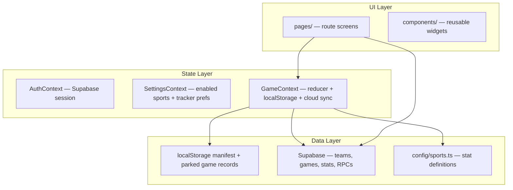
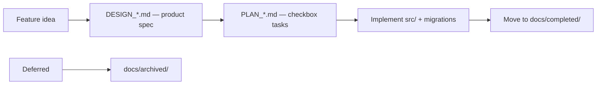

# Agent Codebase Overview

Single entry point for AI agents and new contributors. Read this first (~5 min), then drill into linked docs as needed.

---

## 1. At a glance

- **StatKeeper** — mobile-first PWA for live sports stat tracking (parents/coaches at games)
- **Stack:** React 18 + TypeScript + Vite + Tailwind + HashRouter + Supabase (optional)
- **Primary sport:** Basketball (fully built); 4 others configured but disabled in [`src/config/sports.ts`](../src/config/sports.ts)
- **Offline-first:** Works without Supabase; cloud is incremental sync when env vars are set
- **Commands:** `pnpm dev` (5173) · `pnpm build` · `pnpm lint` · `pnpm test`

Runtime gotchas (HashRouter, localStorage keys, etc.) live in [`AGENTS.md`](../AGENTS.md).

---

## 2. Mental model



**Provider nesting:** `AuthProvider` → (auth gate) → `SettingsProvider` → `GameProvider` → routes.

**Key invariant:** One active game is mounted in `GameContext` at a time, but the device can park multiple local games across sports. The active id lives in `statkeeper_games_manifest`; full snapshots plus per-record sync metadata live at `statkeeper_game:{localGameId}`; `statkeeper_game` remains a legacy/active mirror. Dirty parked records drain through the local sync queue, new cloud `games` rows are created only after roster/player resolution succeeds, and local parking has a 12-game cap with Settings export/import plus parked-only, keep-existing import merge behavior. Discard/hydrate/skipped-final guards in [`gameSyncFingerprint.ts`](../src/lib/gameSyncFingerprint.ts) block silent overwrite or deletion of cloud-bound unsynced work — see [`PLAN_MULTI_GAME_PARKING.md`](PLAN_MULTI_GAME_PARKING.md).

---

## 3. Directory map

| Path | Role | Start here when… |
|------|------|------------------|
| [`src/App.tsx`](../src/App.tsx) | Auth gate + route table | Adding a route |
| [`src/context/GameContext.tsx`](../src/context/GameContext.tsx) | Game reducer, persistence, sync orchestration | Stat tracking, undo, scores, shot chart state |
| [`src/context/AuthContext.tsx`](../src/context/AuthContext.tsx) | Session lifecycle | Auth bugs |
| [`src/context/SettingsContext.tsx`](../src/context/SettingsContext.tsx) | Enabled sports + tracker preferences | Sport visibility, court-capture toggles |
| [`src/config/sports.ts`](../src/config/sports.ts) | Sport stat schema (`SportConfig`) | New sport or stat category |
| [`src/types.ts`](../src/types.ts) | Core domain types | Type changes |
| [`src/lib/cloudSync.ts`](../src/lib/cloudSync.ts) | Upload/download game snapshots | Cloud sync bugs |
| [`src/lib/gameSyncFingerprint.ts`](../src/lib/gameSyncFingerprint.ts) | Sync fingerprint + discard/hydrate/skipped-final guards | Preventing silent local data loss |
| [`src/lib/`](../src/lib/) | Pure helpers (scoring, team stats, shot chart, display) | Business logic without UI |
| [`src/pages/`](../src/pages/) | One screen per route | UI for a feature |
| [`src/components/`](../src/components/) | Shared UI (Scoreboard, StatButton, shot-chart/, team-stats/) | Reusable widgets |
| [`supabase/migrations/`](../supabase/migrations/) | Schema source of truth (001-055) | Any DB change |
| [`docs/`](.) | Design specs and plans | Before building a feature |

**Convention:** Pages orchestrate; heavy logic lives in `lib/` and the `GameContext` reducer.

---

## 4. Routes and user flows

Uses **HashRouter** — URLs look like `http://localhost:5173/#/game`, not `/game`.

| Hash route | Page | Purpose |
|------------|------|---------|
| `/` | SportSelect | Sport choice |
| `/sports` | SportSelect | Sport choice alias |
| `/sport/:sportId` | SportDashboard | Sport-scoped dashboard: active game, parked games, New Game, Teams, Cloud Games, Season Stats |
| `/setup` | GameSetup | Team, opponent, date, season/tournament; `teamId` preselects a cloud team |
| `/players` | PlayerSetup | Roster + active player |
| `/checkout` | GameCheckout | Multi-recorder stat checkout (cloud games) |
| `/game` | GameTracker | Live stat entry, scoreboard, undo; basketball: inline court + event popup |
| `/shot-chart` | ShotChart | **Legacy** — redirects to `/game` (court is inline now) |
| `/summary` | GameSummary / SoccerSummary | Post-game review; soccer resolves local, effective-primary, or canonical-final authority |
| `/settings` | Admin | Settings default/account section |
| `/settings/account` | Admin | Account profile, display-name edit, connected sign-in methods, Google linking, sign out |
| `/settings/app` | Admin | App/general settings, enabled sport toggles |
| `/settings/sports` | Admin | Sport-specific settings index |
| `/settings/sports/:sportId` | Admin | Sport-specific settings, e.g. basketball rebound prompt |
| `/settings/data` | Admin | Parked-game import/export, cloud shortcuts, Seasons |
| `/settings/advanced` | Admin | Player merge and destructive data-management tools |
| `/admin` | Navigate | **Legacy** redirect to `/settings` |
| `/teams` | TeamsList | Cloud team list/create entry, pending invites; `sport` narrows list/create context |
| `/team` | TeamInfo | Team hub with overview, roster, schedule, stats links, Start Game |
| `/team/manage` | TeamManage | Team roster/member management for one team |
| `/team/roster` | TeamRoster | Read-only full roster drill-down |
| `/team/schedule` | TeamSchedule | Team-scoped game schedule drill-down |
| `/team/season` | SeasonInfo | Season detail and team list |
| `/game-info` | GameInfo | Single cloud game detail and summary handoff |
| `/games` | Games | Cloud game history, resume/finalize; `sport` narrows list context |
| `/leaderboard` | Leaderboard | Season/team stat rankings; `sport` narrows season/team choices |
| `/player` | PlayerProfile | Legacy single-player season stats + game log |
| `/player-info` | PlayerProfile | Team-context player info with Back to Team |
| `/career` | CareerStats | Cross-game player career |
| `/team-stats` | TeamStats | Aggregated team-level stats |
| `/tournament-stats` | TournamentStats | Tournament-scoped stats |
| `/dev/shot-chart` | ShotChartPreview | **Dev only** — no auth, sample data |

**Intentional legacy routes (keep; do not remove in unused-route sweeps):**

| Legacy / dual route | Behavior | Prefer going forward |
|---------------------|----------|----------------------|
| `/admin` | Redirects to `/settings` | `/settings/...` section routes |
| `/shot-chart` | Redirects to `/game` (basketball guard) | Inline court on `/game` |
| `/teams?teamId=` | Redirects to `/team/manage?teamId=` | `/team/manage` or Team Info → Manage |
| `/player` + `/player-info` | Same `PlayerProfile` page; `/player-info` adds Back to Team | `playerInfoPath` / `teamInfo` helpers for team context |

**Primary live-game path:** `/` -> `/sport/:sportId` -> `/setup` -> `/players` -> `/checkout?` -> `/game` -> `/summary`

---

## 5. State and cloud sync

**GameContext** is the runtime heart. Every stat tap updates the reducer, persists to the parked `localStorage` record, and drains through the debounced sync queue into `syncGameSnapshotToCloud`.

`GameState.eventStream` is `null` for legacy aggregate-only games and a versioned raw stream
for event-authoritative games. Shared infrastructure lives in `src/lib/gameEvents/`: the
generic engine validates, migrates, quarantines, and orders events, then one projector per
sport rebuilds aggregate state. BKE-1A adds final-state-only atomic update/delete/restore batches
and definition-scoped neutral sides; migrations 050-051 stage and validate the cloud constraint's
`neutral` widening. `src/lib/sportGameState/` owns the multi-sport state union, normalization dispatch, setup
fingerprint, and fail-closed legacy aggregate capability. SOC-2A registers production soccer
match-state schemas and SOC-3A adds shots, own goals, score adjustments, and their semantic
projector rules in `src/lib/soccer/`. Soccer's concrete state holds its immutable resolved setup
and rebuildable runtime projection. Semantic failures preserve raw events, project through the
last coherent event, and expose diagnostics.

BKE-1B adds `src/lib/basketball/` with immutable Basketball rules/setup, side-bearing participants,
strict lifecycle/stat/administrative definitions, and deterministic projection. The catalog covers
shooting, free throws, playmaking, defense, turnovers, score adjustments, fouls, ejections, charged
and neutral timeouts, and manual minutes; projection also derives period team fouls, bonus,
disqualification, team technicals, and located shots. Soccer and Basketball projection rebuilds
share capture-order semantics while display readers retain clock ordering. Basketball is registered
in the internal event runtime, but normal Basketball game creation remains aggregate-only until
the BKE-5 opt-in. BKE-1C1 adds the development-only local Basketball creation toggle and checked
command
foundation in `src/lib/basketball/commands.ts`: intent stamps `gameDataAuthority: 'sport_events'`
before game info, Player Setup snapshots non-pseudo participants, and one atomic helper initializes
the stream plus Period 1. A marked game whose event stream or sport setup is malformed is
quarantined and cannot silently fall back to aggregate sync.

BKE-1C2 routes healthy marked games through checked court commands with projected shot markers,
side/participant capture preferences, and atomic assist/rebound groups. BKE-1C3 adds grouped Recent
Events, newest-first undo/restore, and dependency-aware Clear Chart. BKE-2A adds checked tracked or
opponent late participants, sequential regulation and dynamic overtime controls, local completion,
and generalized Recent Events with non-undoable lifecycle boundaries. BKE-2B restores event-backed
direct player/team stats, unlocated shots and free throws, manual minutes, quick and official score
adjustments, optional atomic Steal + Turnover attribution, and dependency-aware decrements with a
reload-safe inverse receipt. Court/grid/score capture is read-only outside active periods. BKE-2C
is delivered in four slices. BKE-2C1 adds checked structured-foul, linked free-throw-trip, and
stable-position attempt commands; one-and-one enforcement; consequential foul/trip corrections;
and exact reload-safe relationship restore. BKE-2C2 exposes those checked transitions through a
structured foul sheet, resumable awarded-free-throw workspace, player/team grid actions, and
consequence-aware correction confirmations. BKE-2C3 adds checked official player/staff ejections,
optional same-subject foul links, exact removal/restore, and projected unavailable-player enforcement
across court and direct capture. BKE-2C4 completes the phase with checked charged/neutral timeout
capture, immutable finite/unlimited inventory enforcement, simultaneous tracker inventory display,
newest matching current-period correction, and exact restore. BKE-2D completes local tracker parity
with projection-derived period foul/bonus presentation, consistent inactive-period capture guards,
local suspend/abandon/reasoned-reopen controls, and mixed-flow hydration/reprojection coverage. BKE-2
is complete. BKE-3 is complete in four slices. BKE-3A adds a pure Basketball review reader,
Track/Timeline workspace, filtered capture groups, shared event/legacy shot detail, marker activation,
and nearest-marker selection with deterministic ambiguity handling. BKE-3B adds checked arbitrary
event and capture-group removal, conservative dependent restoration, consequence previews, stale
preview rejection, and quick-Undo receipt invalidation. BKE-3C adds atomic F13 shot, location, and
assist/rebound/block editing plus recorded-later field-goal additions. BKE-3D1 adds checked
assist/rebound/steal/block/turnover editing, capture-order-safe relationship repair, historical
single-event additions, and atomic paired Steal + Turnover capture. BKE-3D2 adds checked score and
manual-minutes edits/additions, started-period replay, signed/non-negative total enforcement, reason
preservation, and manual-clock-only participant minutes. BKE-3D3 adds structured foul/free-throw
correction and dependency repair. BKE-3D4 adds ejection/timeout correction and historical additions,
completes parity/regression evidence, and closes the local-model exit audit. BKE-4A1 adds the staged
shared-side widening, private event-platform sport predicate and base binder, permanent Soccer base
wrapper, and migration-046-equivalent revision/checkpoint behavior. BKE-4A2 adds private neutral
setup/adoption, atomic immutable-snapshot enforcement, the permanent Soccer v2 wrapper, and
sport-bounded same-recorder conflict contracts. BKE-4A3 adds private checkpoint-health, primary,
recorder presence/history, manager-selection, and independent-recorder binding cores behind the
unchanged Soccer v3 surface. BKE-4A4 stages and installs the canonical-publication allow-list and
extracts private readiness, finalization, reopen, late-audit, conflict-preparation, checkpoint, v4
binding, and final-state cores behind unchanged Soccer wrappers. Trusted Soccer terminal/score
policy remains server-owned; canonical final-state enforcement applies to all Soccer games and only
event-marked Basketball games, preserving legacy aggregate Basketball. BKE-4A is complete and
BKE-4B1 adds migration 056 plus the shared transport engine and Basketball adapter. BKE-4B2 routes
only marked Basketball event games through that adapter, supports personal and authorized-team
binding in the durable queue, and keeps nonfinal bound games locally authoritative and editable.
BKE-4B3 adds strict current-recorder cloud adoption, resume-first parked bindings, shared explicit
conflict controls, durable recovery metadata, malformed-source quarantine, and duplicate-binding
import protection. Aggregate Basketball remains on snapshot sync; Event creation remained internal
at this phase. The live two-device matrix is the BKE-4B exit signoff. BKE-4C
recorder/finalization product and delivery decisions are approved in four slices. BKE-4C1 adds
migration 057 with role-limited fixed Basketball recorder/readiness,
primary-selection, conflict-preparation, canonical-reader, and manager checkpoint wrappers plus a
private Basketball terminal/score policy. The source-only canonical payload contract is version 1
inside the unchanged platform version-2 envelope. BKE-4C2 adds strict role-limited recorder and
history clients, isolated read-only reprojection, compact tracker health, and Game Info primary
management for team and personal event games. BKE-4C3 adds migration 058 with the fixed
schema-gated finalization wrapper and trusted Basketball dispatch through the shared transaction,
plus isolated primary review, owned-sync flush, checkpoint/conflict preparation, explicit Game
Info confirmation, and canonical authority metadata. BKE-4C4 adds migration 059 with manager
publication history, the fixed Basketball reopen wrapper, reasoned Game Info workflow, owned
parked-binding refresh, and append-only republication path. The BKE-4B matrix remains part of
BKE-4C exit evidence. BKE-4D1 adds one explicit-authority Basketball Summary source boundary for
local, cloud-primary, manager-selected alternate, and canonical review. Final event games require
the canonical publication, remote review remains page-local/read-only, unhealthy projections hide
official output, and the legacy aggregate Basketball Summary remains separate. BKE-4D2 adds
stable participant review, traditional and safe derived player box scores, authoritative team
totals, period foul/bonus/timeout context, discipline, and participant versus team/unknown
attribution. Opponent rows are explicit-only and manual minutes are never inferred. BKE-4D3 adapts
the complete BKE-3 Timeline to explicit Summary authority with oldest-first period groups,
deterministic capture labels, all-family details, removed/revised/recorded-later review, owned-local
correction only, and matching parked-binding handoff. Remote and terminal sources stay read-only.
BKE-4D4 adds active-field-goal Shot Chart review from the same selected authority, with corrected
shared-court locations, side/participant/period/result/value filters, deterministic overlap,
located and unlocated keyboard lists, shared detail/local-only correction, and explicit terminal
tracker/parked-game Summary routing. BKE-4D is implementation-complete; its manual matrix remains
release evidence for BKE-4E.
BKE-4E is approved in five slices: canonical/mixed-history projection, paginated canonical and
legacy source transport, team/season/tournament destinations, player/career compatibility, and a
capability/release exit audit. Event games use active completed publications, legacy games retain
resolved aggregate authority, and a game may contribute through exactly one source family.
Personal games enter only stable-player Profile/Career scopes. BKE-4E1 implements the pure `bk_*`
engine. BKE-4E2 adds migration 060 fixed canonical/legacy source RPCs and strict dual-family client
transport with keyset paging, Soccer wrapper parity, correction resolution, cancellation, metrics,
partial malformed-item isolation, and fail-closed authority collisions. BKE-4E3 routes Leaderboard,
Team Stats, and Tournament Stats through shared mixed-history Basketball destinations with roster
zero rows, provenance, quality, refresh, canonical Summary links, and legacy Game Info review paths.
BKE-4E4 routes Basketball Player Profile and Career through stable-player source pages, separates
scoped team/season totals from authorized Personal history, preserves segment-local metric
availability, and permanently confines compatibility readers to legacy authority. BKE-4E5 adds
migration 061's exact authenticated BKE-4 capability handshake, account-isolated client caching,
and no-mutation preflight for internal event-cloud continuation. BKE-4E is implementation-complete;
the combined live matrix remains required before access broadens, while BKE-5D permits a focused
post-deployment check for the initial owner-only opt-in.
BKE-5 product and delivery decisions are approved in
`PLAN_BKE_5_SETTINGS_AND_EVENT_ROLLOUT.md`. BKE-5A implements seven source-audited immutable
profiles, strict version-2 rules/layer resolution, profile-aware foul/timeout projection, and exact
version-1 compatibility; its regression record is `REGRESSION_BKE_5A_PROFILES.md`. BKE-5B1 adds
migration 062, exact personal/team settings parsers, fixed Basketball CAS wrappers, private strict
validation, metadata-only team audit, and capability contract v2. BKE-5B2 adds account-isolated
personal caches, legacy rebound seeding, offline/conflict reconciliation, one SettingsContext
authority, live rebound consumption, and Rules/Capture/Display personal tabs. BKE-5B3 adds strict
account/team caches, fixed manager CAS writes, reload-only conflicts, and role-aware Team Manage
Basketball Rules with application-default fallback and source diagnostics. BKE-5B4 adds explicit
effective-rule profile review with compatible override preservation, manager-reviewed legacy-season
mapping into an unsaved team draft, and a fail-closed personal-or-team -> match hierarchy contract.
BKE-5B is complete. BKE-5C1 adds the strict account-scoped Basketball setup draft, mutation-free
entry, deferred setup values, and rollback-safe one-step local commit. BKE-5C2 resolves exact
personal/team settings plus match overrides, rechecks stale revisions at Player Setup, freezes the
reviewed version-2 rules/source, and seeds reload-safe per-game court orientation. BKE-5C3 adds
authority-aware capability recovery plus exact durable automatic/local-only policy
normalization across parking and import/export. Local-only is excluded from queue eligibility and
guarded again at Basketball transport entry. BKE-5C4 adds owner-only later cloud enablement with
fresh app/team/capability checks, pre-upload duplicate-binding rejection, confirmed checkpoint-first
binding installation, and rollback-safe local persistence. Team source identity does not become
cloud binding metadata while a game is local-only. BKE-5C is complete. BKE-5D1 implements the
central `internal | opt_in` creation policy, strict default-off device preference, separate Tracker
settings tab, and setup plus atomic commit guards while preserving exact committed pre-start and
all historical Event access. BKE-5D2 activates the production `opt_in` stage while keeping the
device preference and fresh setup default off. Owner smoke remains pending deployment; the complete
BKE-4/BKE-5 matrix remains required before access broadens. Youth Equal-Play uses eight distinct
periods but half-level foul and timeout windows, proving those concepts must be separate.
BKE-6 product planning is approved in `PLAN_BKE_6_CLOCK_AND_LINEUPS.md`: strict rules v3 unlocks a
default-off anchored clock, explicit stoppage context, opening/live lineups, atomic multi-player
substitutions, equal-play policy, exact participation intervals, independent recorder authority,
and a separate additive fixed cloud feature-capability RPC while the exact-shape release-capability
v2 surface remains unchanged. `PLAN_BKE_6A_CLOCK_LINEUP_FOUNDATION.md` details three foundation
PRs: A1 rules v3/setup v2/settings/capability, A2 clock/stoppage projection, and A3 lineup/equal-play
projection, all without production UI. Replay rejects backward wall timestamps while display-only
derivation clamps and warns. BKE-6A1 is implemented through migration 063: v3 settings use one
atomic clock/lineup bundle, immutable built-ins remain v2, setup v2 strictly owns anchored opening
lineups, and a separate exact account-scoped feature capability leaves release-capability v2
untouched. The current v2 setup workflow rejects v3 startup until BKE-6B supplies production setup.
An overdue interval closes exactly once with authoritative Pause source
`expiration`. BKE-6A2 is implemented with strict neutral clock/stoppage envelopes, nullable anchored
clock projection, atomic Start/Pause/Set Clock commands, and pure count-up/countdown display
derivation. Existing clockless event definitions accept the envelope's future nonnegative elapsed
shape, while projection still requires null for every clockless history. Persisting a v3
personal/team setting blocks all new Event setup using that authority
on un-updated clients, including clockless intent, so BKE-6B must warn before save; Legacy setup and
existing snapshots remain available. Mutation-free setup entry stays read-only; running clocks are
intercepted only when Park, setup commit, or game replacement would mutate active state.
BKE-6A3 completes the no-UI foundation with strict lineup, substitution, role, and equal-play event
contracts. Anchored setup derives tracked and optional opponent lineups, boundary confirmations,
ejection/disqualification replacement guards, exact running-clock participation, role history, and
incomplete recovery evidence. Equal-play review is tracked-regulation only and enforced exceptions
require an exact adjacent override/confirmation capture group. Anchored manual-minute events are
inert while clockless parity remains unchanged. BKE-6B is detailed in
`PLAN_BKE_6B_PRODUCTION_SETUP_AND_CLOCK.md` as four slices: device/settings and setup-draft
contracts, local-only production setup with opening-lineup authority, a shared canonical capture-time
path plus sticky live-clock controls, and parking/recovery/exit hardening. BKE-6B includes a narrow
same-current-five confirmation so equal-play-off built-in profiles can cross configured boundaries,
plus a reasoned Set Clock recovery that clamps a backward device timestamp to the wall instant
corresponding to `clock.lastRunningElapsedMs`, preserving the running interval's monotonic watermark.
It deliberately blocks cloud-backed anchored creation until BKE-6D and blocks advisory/enforced
equal-play until BKE-6C supplies candidate-lineup and override controls. Device-only clock alerts
belong under `AppSettings.basketball`, never the CAS-seeded `courtCapture` payload.

The BKE-6B1 contracts slice is implemented: personal/team rule editors deliberately add or remove
the complete version-3 bundle, warn before every version-3 save including conflict Keep Device,
and expose device-only tenths/sound/vibration under `AppSettings.basketball`. Setup drafts now write
strict version 2 restart-safe participant/status/opening-lineup progress while reading version 1
unchanged; pure production-clock policies own local/cloud/equal-play admission, running-clock
detection, and mutation classification. BKE-6B2 adds v3 Event Setup review, explicit anchored
local-only preflight before replacement, restart-safe Starter/Bench/DNP opening-lineup review, and
atomic setup-v2 Period 1 initialization paused at elapsed zero. BKE-6B3 adds the sticky live clock,
canonical command-time capture, Start/Pause/Stoppage/Set Clock, same-five confirmation, expiration,
and exact-watermark recovery without per-tick state writes. See `REGRESSION_BKE_6B1_CLOCK_SETUP_CONTRACTS.md`,
`REGRESSION_BKE_6B2_ANCHORED_SETUP.md`, and `REGRESSION_BKE_6B3_LIVE_CLOCK.md`.
BKE-6B4 completes centralized checked Pause before active-game storage replacement and atomic
Pause-plus-End Period behavior. BKE-6C is approved in
`PLAN_BKE_6C_LIVE_LINEUPS_AND_CORRECTIONS.md` as four slices. BKE-6C1 implements one paused
side-aware substitution sheet, pure candidate model, derived balanced/unbalanced modes, structured
reasons, atomic capture, optional opponent authority, and final exact lineup-family payload forms;
see `REGRESSION_BKE_6C1_LIVE_SUBSTITUTIONS.md`. BKE-6C2 next owns boundary/equal-play review, then
roles/current-lineup recovery and grouped correction/exit follow. BKE-6D and BKE-6E remain; rules versions 1-2, setup version 1, and existing games remain
clockless, and shot-clock/possession work stays out.

SOC-3A derives soccer score, side attacking totals, player attacking totals, and goalkeeper
totals from active event revisions. Event actors use stable match `participantId` references;
later anonymous-player resolution maps those totals without rewriting event history. Projected
on-field and role intervals validate late historical attribution while attacking events leave
the anchored live clock unchanged. SOC-3B adds the full-pitch live capture surface, display-only
field flipping, persisted side/participant defaults, side-aware linked actors, quick goals, and
projection-driven score. SOC-3C adds filtered field markers, the unified Timeline, shared
attacking-event correction, bounded historical adds, scoring history, and signed score
adjustments. SOC-4A adds version-2 rule/state normalization, the remaining event schemas,
phased incident projection, temporal discipline dependencies, normal-match derived totals,
shootout sequencing, and structured outcomes through pure APIs.
SOC-4B exposes normal-match defense, foul, discipline, corner, and offside capture and review.
SOC-4C adds the gated shootout setup and dedicated kick workspace, eligibility and goalkeeper
management, shootout-scope cards, revisioned kick correction, separate shootout scoring, and
explicit completed/suspended/abandoned outcomes. SOC-5A adds idempotent team/personal cloud
binding, game-scoped participant snapshots, revision uploads, and verified recorder checkpoints.
SOC-5B adds immutable setup recovery, pull-before-push same-recorder merge, event-aware Cloud Games
resume, and durable side-by-side conflict resolution. SOC-5C adds independent team recorder
binding, compact recorder presence, isolated read-only stream projection, provisional primary
selection, and immutable selection history. SOC-5D adds append-only canonical publications,
owner/admin primary locking, manager conflict preparation, final review, late non-primary audit
uploads, and reason-required audited reopen. Soccer remains development-only until SOC-6.

SOC-2B and SOC-2C added the Soccer workspace through the normal chooser and dashboard. The
shared `/setup`, `/players`, and `/game` routes select soccer-specific setup,
roster, kickoff, and live tracker pages while a soccer game is active. `SoccerGameTracker`
renders the anchored clock without per-second reducer writes and uses checked helpers in
`src/lib/soccer/live.ts` for periods, substitutions, roles, direction, rules, participant
changes, history corrections, diagnostics, and match end/reopen. SOC-6E1 keeps those existing
record routes available in production, and SOC-6E3 makes new Soccer discovery and creation a
device-local production opt-in. Cloud teams are read-only roster
sources; SOC-5A mirrors healthy local event streams, SOC-5B resumes the same recorder from cloud,
and SOC-5C lets additional authorized team recorders start independent streams against the same
game while viewers inspect only the primary stream. SOC-5D review resolves the active canonical
publication when final and uses the live primary only before finalization or after reopen.
Legacy `/checkout` redirects active soccer games back into the soccer flow. SOC-6A uses
`/summary` for an Overview-only local/cloud soccer summary and redirects legacy
`/soccer/review` links there without activating parked games.

SOC-6B adds Players, Timeline, Field, and Shootout review to that shared Summary authority path.
SOC-6C1 establishes the cross-game canonical read contract in
`src/lib/soccer/aggregateStats.ts` and `src/lib/soccer/aggregateProjection.ts`: only healthy
completed canonical publications project into totals, stable cloud player ids are the sole
cross-match identity, unresolved participant instances stay excluded and visible, and rates are
derived after raw values combine. SOC-6C2 adds the RLS/keyset source RPCs in migration 047 and
`src/lib/soccer/aggregateTransport.ts`, which fully drains validated pages, shares only in-flight
loads, isolates consumer cancellation, projects cooperatively, and reports typed failures and
metrics. SOC-6C3 routes Soccer Leaderboard, Team Stats, and Tournament Stats through those
canonical sources with shared category tables, active-roster zero rows, Overview/Players/Games,
partial-quality authorization, and refresh/focus lifecycle behavior. SOC-6C4 adds stable-player
Profile and Career destinations with Participation-at-zero, all-zero category suppression,
canonical per-game/season history, direct Summary links, and route guards that keep legacy
aggregate RPCs exclusive to non-soccer sports.

SOC-6D1 adds the versioned settings foundation.
`src/lib/soccer/settings.ts` strictly separates configurable rules from legacy derived availability
mirrors and resolves built-in, personal, team, and match layers with source metadata and
whole-layer diagnostics. `src/lib/sportSettingsStorage.ts` provides anonymous and user-keyed local
cache records. Migration 048 adds generic user/team sport-settings tables, read-only RLS, and
revision-aware soccer write RPCs. SOC-6D2 mounts cache-first personal reconciliation in
`SettingsContext` through `useSoccerPersonalSettings`, including anonymous bootstrap, pending
offline saves, focus/online/manual retry, and explicit revision-conflict choices.
`Settings -> Sports -> Soccer` edits the complete personal schema in compact grouped sections.
SOC-6D3 adds account-and-team-scoped shared caches plus `useSoccerTeamSettings`; Team Manage
provides owner/admin shared editing and compatible-team copy while scorer/viewer access is
read-only. Soccer Match Setup resolves built-in, personal, selected-team, and sparse match layers
with per-field source labels, preserves existing snapshots until deliberate edits, and persists a
new complete snapshot only on Continue.
SOC-6D4 contains browser-storage failures without losing coherent in-session settings, keeps
invalid or unsupported cached/cloud objects out of the hierarchy, verifies that shared audit
failure rolls back the same settings transaction, and hardens keyboard/status/reset and narrow
layout behavior. The automated and operator checks are mapped in
`docs/REGRESSION_SOC_6D_SETTINGS.md`. No migration follows 048 for SOC-6D4.

SOC-6E1 centralizes release, discovery/new-game, and existing-record policy in
`src/lib/sportAvailability.ts`. Development preview now respects the device Soccer toggle;
SOC-6E3 enables the same opt-in policy in production while the stored default remains off.
Existing local and cloud Soccer routes do not depend on development mode. Migration 049 adds an
authenticated read-only capability handshake for the
complete Soccer cloud boundary. Team Info, team setup deep links, and Soccer cloud-source
continuation verify that contract before replacing an active game or committing cloud authority;
failures preserve the current game and offer an explicit local-only path.
SOC-6E2 hardens malformed legacy settings, keeps direct development checks on an explicit
diagnostic/policy allowlist, and consolidates release evidence in
`docs/REGRESSION_SOC_6E_RELEASE.md`. Development/staging and unreleased-production operator
results plus final deployed production evidence remain the post-deployment checklist for the
approved owner-only rollout and a gate before access materially broadens.

The `game_events` repository is wired into the automatic queue only for healthy soccer event
games through `src/lib/soccer/cloudSync.ts`. Aggregate cloud sync remains disabled as soon as
sport-owned setup exists, and soccer is also rejected as an aggregate sport before setup;
aggregate reducer mutations are disabled once an event stream is
initialized. A soccer record is clean only after the server verifies its exact recorder
event-id/revision checkpoint.

### localStorage keys

Defined in [`src/lib/gameStorageKeys.ts`](../src/lib/gameStorageKeys.ts):

| Key | Contents |
|-----|----------|
| `statkeeper_games_manifest` | Active local id, parked local ids, and row summaries |
| `statkeeper_game:{localGameId}` | Full parked `GameState` record + dirty/revision sync metadata |
| `statkeeper_game` | Legacy / active `GameState` mirror for migration compatibility |
| `statkeeper_game_owner` | User id — prevents cross-account bleed for the legacy mirror |
| `statkeeper_pending_sync` | Legacy/derived dirty flag for hydration guards; per-game dirty state lives on parked records |
| `statkeeper_settings` | Enabled sports map |

### Cloud upload chain

In [`src/lib/cloudSync.ts`](../src/lib/cloudSync.ts):

```
season → team → game → players/roster → game_stats → shot_chart → team placeholder FKs
```

Most sync is **direct table CRUD**, not RPCs.

### When RPCs matter

- **Live tracking** writes raw `game_stats` rows.
- **Finalized games** and analytics read via resolved RPCs.
- Multi-recorder resolution order: **correction > primary > sole > averaged**.

### Sync integrity guards

Helpers live in [`src/lib/gameSyncFingerprint.ts`](../src/lib/gameSyncFingerprint.ts); `GameContext` and UI callers enforce them.

| Guard | When it fires | Effect |
|-------|---------------|--------|
| `shouldDeferCloudResumeHydration` / `shouldBlockManualCloudHydrate` | Pending durable sync, missing fingerprint, or local fingerprint ≠ last synced | Blocks auto/manual hydrate that would overwrite newer local progress |
| `shouldSkipAutoHydrateForDifferentCloudGame` | Active local session already has a different `cloudSync.gameId` | Auto "resume latest cloud game" skips; manual open parks first via `openGameSnapshot` |
| `shouldBlockDiscardUnsyncedGame` | Cloud-bound game (`teamId` and/or `gameId`) with dirty flag, missing fingerprint, or fingerprint mismatch; also blocks pre-first-sync (`teamId` without `gameId`) | Discard / New Game wipe / finalize reset is blocked until sync; pure local games (`!teamId && !gameId`) are allowed |
| `shouldRejectSkippedFinalSync` | Cloud returns `skippedFinalGame` but snapshot **or** post-await latest local state still has unsynced edits | Sync does not report success; dirty cleared to stop auto-retry (cloud is final) while fingerprint mismatch still blocks discard |

**Constraint:** Checking only the sync-start snapshot for skipped-final used to mark success while mid-sync edits remained local and `gameStatus: 'final'` cleared the dirty queue forever. Always evaluate both snapshot and latest parked state.

**Deep dives:** Schema and RLS → [`INTEGRATION_PLAN.md`](INTEGRATION_PLAN.md) §1.2 · Parking plan → [`PLAN_MULTI_GAME_PARKING.md`](PLAN_MULTI_GAME_PARKING.md) · Migration list → [`README.md`](../README.md) Supabase Setup.

---

## 6. Domain glossary

| Concept | Meaning |
|---------|---------|
| **Season** | Top of hierarchy; teams and games belong to a season |
| **Team / roster** | `teams` + `team_players` junction — jersey # is per-team, not on `players` |
| **Player pool** | Global `players` rows; guardians linked via `player_guardians` |
| **Tournament** | First-class entity; games FK `tournament_id` |
| **Checkout** | Multi-parent: each recorder submits stats; primary chosen on finalize |
| **Resolved stats** | Post-game truth via RPCs after checkout + admin corrections |
| **Team pseudo-players** | `__team_home__` / `__team_opp__` in [`teamPlayers.ts`](../src/lib/teamPlayers.ts) for fouls, timeouts, etc. |
| **Shot chart** | `ShotRecord[]` in game state + `shot_chart` table (migration 032) |
| **Event stream** | Versioned raw `GameEventStream`; authoritative only when non-null, with derived projection health |
| **Team placeholders** | Cloud `players.is_team_placeholder` rows backing team-level stats |

---

## 7. Supabase cheat sheet

| Item | Detail |
|------|--------|
| Migrations | 49 files (`001`-`049`) in [`supabase/migrations/`](../supabase/migrations/) |
| Tables | 22 core tables (profiles, account_access, access_audit_events, teams, players, games, game_participants, game_events, game_event_stream_checkpoints, stats, seasons, tournaments, shot_chart, team_invite_links, …) |
| Auth | Email/password + Google OAuth (PKCE), account profile/identities, app access status; team RLS scoped via `team_members` roles (owner / admin / scorer / viewer) |
| Schema source | Always read the migration file — pre-018 ERDs in INTEGRATION_PLAN are stale |
| Destructive | Migration **018** redesigned seasons/roster — backup before applying on existing DBs |
| Pre-flight | Run `supabase/scripts/audit_data_integrity_pre_019.sql` before migration **019** |
| Soccer aggregate pre-flight | Run `supabase/scripts/audit_soccer_participant_sources_pre_047.sql` before migration **047** |

**Top RPCs the frontend calls:**

| RPC | Used for |
|-----|----------|
| `get_game_stats_resolved` | Game Summary, hydration of final games, analytics |
| `get_season_stats_resolved` | Non-soccer Leaderboard and Player Profile |
| `get_career_stats_resolved` | Non-soccer Career Stats |
| `get_tournament_stats_resolved` | Tournament Stats |
| `get_game_team_stats` | Game Summary team tab |
| `get_player_game_log` / `get_team_game_log` | Profile / team game lists |
| `get_player_stat_high_games` | Career "Best game" links |
| `set_primary_recorder` | Admin on Game Summary |
| `invite_team_member` / `lookup_user_by_email` | Team invites |
| `create_team_invite_link` / `redeem_team_invite_link` | Single-use team invite links |
| `claim_player_guardianship` / `remove_player_guardian` | Bounded player guardian management |
| `get_access_audit_events` | Team-scoped or app-admin-global access history |
| `update_player_identity` | Creator/guardian identity-only player editing |
| `merge_players_preview` / `merge_players_execute` | Player merge wizard |
| `bind_soccer_event_game_v4` / `confirm_game_event_stream_checkpoint` | SOC-5A-D game binding, setup/participant snapshots, independent recorder joining, verified sync, and final audit completion |
| `record_game_event_conflict` / `resolve_game_event_conflict` | SOC-5B durable same-recorder conflict recovery |
| `get_soccer_game_recorders` / `set_soccer_primary_recorder` | SOC-5C recorder presence and provisional owner/admin primary resolution |
| `get_soccer_primary_recorder_history` | SOC-5C immutable primary-selection history |
| `get_soccer_finalization_readiness` / `finalize_soccer_event_game` | SOC-5D manager readiness, primary lock, and canonical publication |
| `get_soccer_canonical_publication` / `reopen_soccer_event_game` | SOC-5D canonical review and reason-required audited reopen |
| `get_soccer_primary_conflicts_for_finalization` / `resolve_soccer_primary_conflict_for_finalization` | SOC-5D manager preparation of unresolved primary conflicts |

Without Supabase env vars, `supabase.ts` returns `null` and the app skips auth (`isConfigured === false`).

---

## 8. How work gets done

### Doc taxonomy



| Location / prefix | Meaning |
|-------------------|---------|
| `docs/DESIGN_*` | Active product spec (living) |
| `docs/PLAN_*` | Execution plan: tasks, file lists, pre-handoff decisions |
| `docs/completed/` | Shipped — reference when extending existing features |
| `docs/archived/` | Deferred / not building now |
| [`REGRESSION_TESTING.md`](REGRESSION_TESTING.md) | Manual test scripts — extend when behavior changes |
| [`INTEGRATION_PLAN.md`](INTEGRATION_PLAN.md) | Cloud architecture bible (long; use as reference) |

### Active / next work (check before starting)

| Doc | Topic |
|-----|-------|
| [`ACCESS_MATRIX.md`](ACCESS_MATRIX.md) / [`PLAN_ADMIN_SECURITY_ROADMAP.md`](PLAN_ADMIN_SECURITY_ROADMAP.md) | SEC-0 through SEC-6 complete; later audit event-family expansion is documented in SEC-6 |
| [`PLAN_MULTI_GAME_PARKING.md`](PLAN_MULTI_GAME_PARKING.md) | P0–P3b shipped (incl. discard/hydrate race guards); IndexedDB + orphan ops follow-ups remain |
| [`PLAN_SOC_5_CLOUD_SYNC_AND_FINALIZATION.md`](PLAN_SOC_5_CLOUD_SYNC_AND_FINALIZATION.md) / [`PLAN_SOC_5D_FINALIZATION_AND_RECOVERY.md`](PLAN_SOC_5D_FINALIZATION_AND_RECOVERY.md) | SOC-5 decisions and phases; SOC-5A-D transport through canonical finalization implemented |
| [`PLAN_SOC_6_SUMMARY_AND_RELEASE.md`](PLAN_SOC_6_SUMMARY_AND_RELEASE.md) / [`PLAN_SOC_6A_SUMMARY_FOUNDATION.md`](PLAN_SOC_6A_SUMMARY_FOUNDATION.md) / [`PLAN_SOC_6B_DETAILED_MATCH_REVIEW.md`](PLAN_SOC_6B_DETAILED_MATCH_REVIEW.md) / [`PLAN_SOC_6C_CANONICAL_AGGREGATES.md`](PLAN_SOC_6C_CANONICAL_AGGREGATES.md) / [`PLAN_SOC_6D_SOCCER_SETTINGS.md`](PLAN_SOC_6D_SOCCER_SETTINGS.md) / [`PLAN_SOC_6E_RELEASE_HARDENING.md`](PLAN_SOC_6E_RELEASE_HARDENING.md) / [`PLAN_SOC_FIELD_TEST_BACKLOG.md`](PLAN_SOC_FIELD_TEST_BACKLOG.md) / [`PLAN_SOC_RESTARTS.md`](PLAN_SOC_RESTARTS.md) | SOC-6A through SOC-6E3 implemented; owner-only production opt-in approved with post-deployment validation pending. Post-release soccer issues live in the field-test backlog. Restart capture (`S17`/`S20`) has an approved reader-first plan in `PLAN_SOC_RESTARTS.md`: corner, throw-in, and goal-kick capture use a one-shot tap-to-place field flow, and an omitted taker stores no actor |
| [`PLAN_BASKETBALL_EVENT_MODEL_ROADMAP.md`](PLAN_BASKETBALL_EVENT_MODEL_ROADMAP.md) / [`PLAN_BKE_2_COMPLETE_EVENT_CAPTURE.md`](PLAN_BKE_2_COMPLETE_EVENT_CAPTURE.md) / [`PLAN_BKE_3_EVENT_TIMELINE_AND_F13.md`](PLAN_BKE_3_EVENT_TIMELINE_AND_F13.md) / [`PLAN_BKE_4_EVENT_CLOUD_CUTOVER.md`](PLAN_BKE_4_EVENT_CLOUD_CUTOVER.md) / [`PLAN_BKE_4A_NEUTRAL_RPC_EXTRACTION.md`](PLAN_BKE_4A_NEUTRAL_RPC_EXTRACTION.md) / [`PLAN_BKE_4B_BASKETBALL_TRANSPORT.md`](PLAN_BKE_4B_BASKETBALL_TRANSPORT.md) / [`PLAN_BKE_4C_RECORDERS_AND_FINALIZATION.md`](PLAN_BKE_4C_RECORDERS_AND_FINALIZATION.md) / [`PLAN_BKE_4D_SUMMARY_AUTHORITY.md`](PLAN_BKE_4D_SUMMARY_AUTHORITY.md) / [`PLAN_BKE_4E_AGGREGATES_AND_RELEASE_READINESS.md`](PLAN_BKE_4E_AGGREGATES_AND_RELEASE_READINESS.md) / [`PLAN_BKE_5_SETTINGS_AND_EVENT_ROLLOUT.md`](PLAN_BKE_5_SETTINGS_AND_EVENT_ROLLOUT.md) / [`PLAN_BKE_5C_SETUP_AUTHORITY_AND_BINDING.md`](PLAN_BKE_5C_SETUP_AUTHORITY_AND_BINDING.md) / [`PLAN_BKE_5D_RELEASE_AND_EXIT.md`](PLAN_BKE_5D_RELEASE_AND_EXIT.md) / [`PLAN_BKE_6_CLOCK_AND_LINEUPS.md`](PLAN_BKE_6_CLOCK_AND_LINEUPS.md) / [`PLAN_BKE_6C_LIVE_LINEUPS_AND_CORRECTIONS.md`](PLAN_BKE_6C_LIVE_LINEUPS_AND_CORRECTIONS.md) / [`REGRESSION_BKE_4C_FINALIZATION.md`](REGRESSION_BKE_4C_FINALIZATION.md) / [`REGRESSION_BKE_4D_SUMMARY.md`](REGRESSION_BKE_4D_SUMMARY.md) / [`REGRESSION_BKE_4E_AGGREGATES.md`](REGRESSION_BKE_4E_AGGREGATES.md) / [`REGRESSION_BKE_4E_TRANSPORT.md`](REGRESSION_BKE_4E_TRANSPORT.md) / [`REGRESSION_BKE_4E_DESTINATIONS.md`](REGRESSION_BKE_4E_DESTINATIONS.md) / [`REGRESSION_BKE_4E_PLAYER_CAREER.md`](REGRESSION_BKE_4E_PLAYER_CAREER.md) / [`REGRESSION_BKE_4E_RELEASE_READINESS.md`](REGRESSION_BKE_4E_RELEASE_READINESS.md) / [`REGRESSION_BKE_5A_PROFILES.md`](REGRESSION_BKE_5A_PROFILES.md) / [`REGRESSION_BKE_5B1_SETTINGS_FOUNDATION.md`](REGRESSION_BKE_5B1_SETTINGS_FOUNDATION.md) / [`REGRESSION_BKE_5B2_PERSONAL_SETTINGS.md`](REGRESSION_BKE_5B2_PERSONAL_SETTINGS.md) / [`REGRESSION_BKE_5B3_TEAM_SETTINGS.md`](REGRESSION_BKE_5B3_TEAM_SETTINGS.md) / [`REGRESSION_BKE_5B4_UPGRADES_IMPORT.md`](REGRESSION_BKE_5B4_UPGRADES_IMPORT.md) / [`REGRESSION_BKE_5B_SETTINGS.md`](REGRESSION_BKE_5B_SETTINGS.md) / [`REGRESSION_BKE_6A1_RULES_SETUP.md`](REGRESSION_BKE_6A1_RULES_SETUP.md) / [`REGRESSION_BKE_6A2_CLOCK_PROJECTION.md`](REGRESSION_BKE_6A2_CLOCK_PROJECTION.md) / [`REGRESSION_BKE_6A3_LINEUP_PROJECTION.md`](REGRESSION_BKE_6A3_LINEUP_PROJECTION.md) / [`REGRESSION_BKE_6C1_LIVE_SUBSTITUTIONS.md`](REGRESSION_BKE_6C1_LIVE_SUBSTITUTIONS.md) | Basketball migration onto the shared event model. BKE-1 through BKE-3, BKE-4A through BKE-4E, BKE-5A through BKE-5D2, BKE-6A1 through BKE-6A3, BKE-6B1 through BKE-6B4, and BKE-6C1 are implemented through migration 063. BKE-6C2 is next. Deployment smoke remains before BKE-5 closes, and the complete live matrix still gates broader access |
| [`PLAN_BKE_6A_CLOCK_LINEUP_FOUNDATION.md`](PLAN_BKE_6A_CLOCK_LINEUP_FOUNDATION.md) | Detailed BKE-6A1 through BKE-6A3 foundation plan for rules/setup/settings/capability, clock/stoppage projection, and lineup/equal-play projection; no production UI |
| [`PLAN_BKE_6B_PRODUCTION_SETUP_AND_CLOCK.md`](PLAN_BKE_6B_PRODUCTION_SETUP_AND_CLOCK.md) | Complete BKE-6B1 through BKE-6B4 plan: contracts, guarded local setup/opening lineups, canonical live clock, and parking/period-flow exit |
| [`PLAN_BKE_6C_LIVE_LINEUPS_AND_CORRECTIONS.md`](PLAN_BKE_6C_LIVE_LINEUPS_AND_CORRECTIONS.md) / [`REGRESSION_BKE_6C1_LIVE_SUBSTITUTIONS.md`](REGRESSION_BKE_6C1_LIVE_SUBSTITUTIONS.md) | Approved BKE-6C1 through BKE-6C4 plan: live substitutions are implemented; boundary/equal-play review is next, followed by roles/recovery and correction/exit |
| [`REGRESSION_BKE_6B1_CLOCK_SETUP_CONTRACTS.md`](REGRESSION_BKE_6B1_CLOCK_SETUP_CONTRACTS.md) / [`REGRESSION_BKE_6B2_ANCHORED_SETUP.md`](REGRESSION_BKE_6B2_ANCHORED_SETUP.md) / [`REGRESSION_BKE_6B3_LIVE_CLOCK.md`](REGRESSION_BKE_6B3_LIVE_CLOCK.md) / [`REGRESSION_BKE_6B_PRODUCTION_CLOCK.md`](REGRESSION_BKE_6B_PRODUCTION_CLOCK.md) | Complete BKE-6B device/settings/draft, setup, live clock, and production exit evidence |
| [`REGRESSION_BKE_5_SETTINGS_AND_ROLLOUT.md`](REGRESSION_BKE_5_SETTINGS_AND_ROLLOUT.md) | BKE-5D1 hardening and BKE-5D2 default-off production activation evidence; deployment smoke, rollback, and the broader-release matrix remain |

### Held / waiting for feedback

| Doc | Topic |
|-----|-------|
| [`DESIGN_SHOT_TRACKER_UI_REVAMP.md`](DESIGN_SHOT_TRACKER_UI_REVAMP.md) | Court-capture program status (F1–F13) |
| [`PLAN_COURT_CAPTURE_ENHANCEMENTS_ROADMAP.md`](PLAN_COURT_CAPTURE_ENHANCEMENTS_ROADMAP.md) | Court-capture roadmap; F10 superseded by F13 |
| [`PLAN_F13_SHOT_DETAIL_EDIT_MODAL.md`](PLAN_F13_SHOT_DETAIL_EDIT_MODAL.md) | Superseded implementation draft; product intent is owned by the approved BKE-3 plan |
| [`PLAN_SOC_FIELD_TEST_BACKLOG.md`](PLAN_SOC_FIELD_TEST_BACKLOG.md) | Post-SOC-6 soccer field-test backlog. Owner-confirmed through `S21` (sideline layout, default role, Timeline shot edit, opponent-actor lock, finalize mismatch, header, placement, corner UI cleanup, upside-down flip counts, team formation lineup, throw-ins not in product, season create has no name field). Do not implement from the backlog; expand one confirmed item at a time |

**Court program status:** F1-F9 and F12 are implemented; manual Supabase-heavy QA remains in
[`REGRESSION_TESTING.md`](REGRESSION_TESTING.md). F10 standalone marker numbering is no
longer needed and is superseded by F13. F11 remains held pending further user feedback.
F13 product intent is now owned by the approved BKE-3A through BKE-3D plan. Do not implement the
superseded `ShotRecord`/`shot_chart` metadata proposal from the standalone draft.

### Verification norms

CI ([`.github/workflows/ci.yml`](../.github/workflows/ci.yml)): `pnpm lint` → `pnpm test` → `pnpm build`.

Vitest covers pure helpers in `src/lib/` plus small component-adjacent helpers such as
court geometry. UI validated manually via [`REGRESSION_TESTING.md`](REGRESSION_TESTING.md).

When shipping a feature, plans typically call for updating this overview (if architecture changes), `AGENTS.md`, `REGRESSION_TESTING.md`, and `README.md`.

---

## 9. Common agent tasks

| If you need to… | Start here |
|-----------------|------------|
| Add a stat or configured sport | [`sports.ts`](../src/config/sports.ts) + [`types.ts`](../src/types.ts); use the SOC-0 plan as the pattern for full sport-specific support |
| Change game tracker behavior | [`GameContext.tsx`](../src/context/GameContext.tsx) + [`GameTracker.tsx`](../src/pages/GameTracker.tsx) |
| Fix cloud sync | [`cloudSync.ts`](../src/lib/cloudSync.ts) + [`gameSyncFingerprint.ts`](../src/lib/gameSyncFingerprint.ts) + `GameContext` hydration guards |
| Game Summary / finalize | [`GameSummary.tsx`](../src/pages/GameSummary.tsx) + `get_game_stats_resolved` |
| Team stats (basketball) | [`completed/DESIGN_TEAM_STATS_TRACKING.md`](completed/DESIGN_TEAM_STATS_TRACKING.md) |
| Shot chart | [`completed/DESIGN_SHOT_CHART_IMPLEMENTATION.md`](completed/DESIGN_SHOT_CHART_IMPLEMENTATION.md) |
| Shared sport events | [`PLAN_SOC_1_SHARED_EVENT_FOUNDATION.md`](PLAN_SOC_1_SHARED_EVENT_FOUNDATION.md) + `src/lib/gameEvents/` |
| Team Info hub | [`completed/PLAN_TEAM_INFO_DRILLDOWN_IMPLEMENTATION.md`](completed/PLAN_TEAM_INFO_DRILLDOWN_IMPLEMENTATION.md) |
| DB schema change | New numbered migration in `supabase/migrations/`; update README migration list |
| Assigned a `PLAN_F*` task | Read that plan end-to-end first — it lists exact files and dependencies |
| Add a route | [`App.tsx`](../src/App.tsx) + new page in `src/pages/` |

---

## 10. Pitfalls

- **HashRouter** — paths are `/#/game`, not `/game`
- **One mounted active game** — new game flow parks the current record and creates a new active `localGameId`; dirty parked games sync by local id
- **Unsynced cloud discard is blocked** — parked Discard / New Game wipe / finalize reset refuse cloud-bound dirty games; resume and sync first (`shouldBlockDiscardUnsyncedGame`)
- **Auto-hydrate will not steal another cloud game** — if the active local session is already bound to a different `cloudSync.gameId`, sign-in resume skips overwrite
- **Skipped-final is not success with local edits** — when cloud game is already `final`, mid-sync local edits must not clear the queue as a successful sync
- **Supabase optional** — `isConfigured` gates auth; app works fully offline without env vars
- **Migration 018** is destructive (drops old columns); backup first
- **Migration 019** aborts on bad data — run audit script first
- **INTEGRATION_PLAN** pre-018 ERD is stale; trust migrations
- **Career GP** may double-count across team stints (documented product acceptance)
- **Dev shot chart** at `/#/dev/shot-chart` bypasses auth (DEV only)
- **pnpm builds** — `onlyBuiltDependencies` allowlists `esbuild`; no interactive approve step

---

## 11. Further reading

Read this overview first, then pick by need:

| Need | Document |
|------|----------|
| Cloud architecture depth | [`INTEGRATION_PLAN.md`](INTEGRATION_PLAN.md) |
| Manual testing | [`REGRESSION_TESTING.md`](REGRESSION_TESTING.md) |
| Shipped feature specs | [`docs/completed/`](completed/) |
| In-flight execution plans | [`docs/PLAN_*`](.) |
| Human feature list + roadmap | [`README.md`](../README.md) |
| Runtime ops + gotchas | [`AGENTS.md`](../AGENTS.md) |
