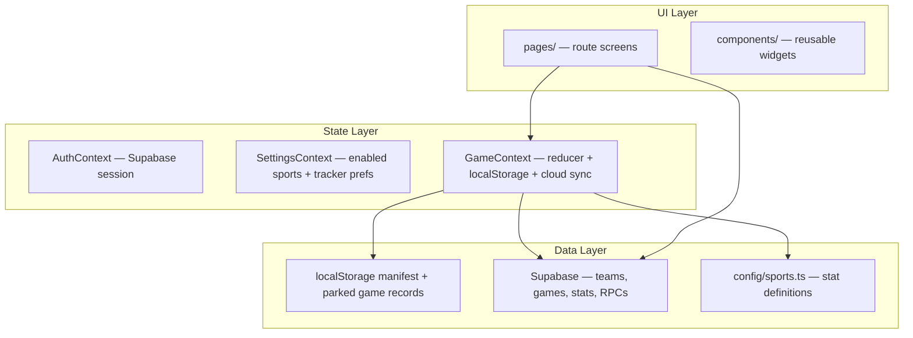
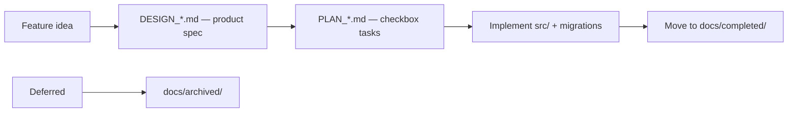

# Agent Codebase Overview

Single entry point for AI agents and new contributors. Read this first (~5 min), then drill into linked docs as needed.

---

## 1. At a glance

- **StatKeeper** — mobile-first PWA for live sports stat tracking (parents/coaches at games)
- **Stack:** React 18 + TypeScript + Vite + Tailwind + HashRouter + Supabase (optional)
- **Primary sport:** Basketball (fully built); 4 others configured but disabled in [`src/config/sports.ts`](../src/config/sports.ts)
- **Offline-first:** Works without Supabase; cloud is incremental sync when env vars are set
- **Commands:** `pnpm dev` (5173) · `pnpm build` · `pnpm lint` · `pnpm test`

Runtime gotchas (HashRouter, localStorage keys, etc.) live in [`AGENTS.md`](../AGENTS.md).

---

## 2. Mental model



**Provider nesting:** `AuthProvider` → (auth gate) → `SettingsProvider` → `GameProvider` → routes.

**Key invariant:** One active game is mounted in `GameContext` at a time, but the device can park multiple local games across sports. The active id lives in `statkeeper_games_manifest`; full snapshots plus per-record sync metadata live at `statkeeper_game:{localGameId}`; `statkeeper_game` remains a legacy/active mirror. Dirty parked records drain through the local sync queue, new cloud `games` rows are created only after roster/player resolution succeeds, and local parking has a 12-game cap with Settings export/import plus parked-only, keep-existing import merge behavior — see [`PLAN_MULTI_GAME_PARKING.md`](PLAN_MULTI_GAME_PARKING.md).

---

## 3. Directory map

| Path | Role | Start here when… |
|------|------|------------------|
| [`src/App.tsx`](../src/App.tsx) | Auth gate + route table | Adding a route |
| [`src/context/GameContext.tsx`](../src/context/GameContext.tsx) | Game reducer, persistence, sync orchestration | Stat tracking, undo, scores, shot chart state |
| [`src/context/AuthContext.tsx`](../src/context/AuthContext.tsx) | Session lifecycle | Auth bugs |
| [`src/context/SettingsContext.tsx`](../src/context/SettingsContext.tsx) | Enabled sports + tracker preferences | Sport visibility, court-capture toggles |
| [`src/config/sports.ts`](../src/config/sports.ts) | Sport stat schema (`SportConfig`) | New sport or stat category |
| [`src/types.ts`](../src/types.ts) | Core domain types | Type changes |
| [`src/lib/cloudSync.ts`](../src/lib/cloudSync.ts) | Upload/download game snapshots | Cloud sync bugs |
| [`src/lib/`](../src/lib/) | Pure helpers (scoring, team stats, shot chart, display) | Business logic without UI |
| [`src/pages/`](../src/pages/) | One screen per route | UI for a feature |
| [`src/components/`](../src/components/) | Shared UI (Scoreboard, StatButton, shot-chart/, team-stats/) | Reusable widgets |
| [`supabase/migrations/`](../supabase/migrations/) | Schema source of truth (001–034) | Any DB change |
| [`docs/`](.) | Design specs and plans | Before building a feature |

**Convention:** Pages orchestrate; heavy logic lives in `lib/` and the `GameContext` reducer.

---

## 4. Routes and user flows

Uses **HashRouter** — URLs look like `http://localhost:5173/#/game`, not `/game`.

| Hash route | Page | Purpose |
|------------|------|---------|
| `/` | SportSelect | Sport choice |
| `/sports` | SportSelect | Sport choice alias |
| `/sport/:sportId` | SportDashboard | Sport-scoped dashboard: active game, parked games, New Game, Teams, Cloud Games, Season Stats |
| `/setup` | GameSetup | Team, opponent, date, season/tournament; `teamId` preselects a cloud team |
| `/players` | PlayerSetup | Roster + active player |
| `/checkout` | GameCheckout | Multi-recorder stat checkout (cloud games) |
| `/game` | GameTracker | Live stat entry, scoreboard, undo; basketball: inline court + event popup |
| `/shot-chart` | ShotChart | **Legacy** — redirects to `/game` (court is inline now) |
| `/summary` | GameSummary | Post-game review, finalize, sync |
| `/settings` | Admin | Settings default/account section |
| `/settings/account` | Admin | Account profile, display-name edit, connected sign-in methods, Google linking, sign out |
| `/settings/app` | Admin | App/general settings, enabled sport toggles |
| `/settings/sports` | Admin | Sport-specific settings index |
| `/settings/sports/:sportId` | Admin | Sport-specific settings, e.g. basketball rebound prompt |
| `/settings/data` | Admin | Parked-game import/export, cloud shortcuts, Seasons |
| `/settings/advanced` | Admin | Player merge and destructive data-management tools |
| `/admin` | Navigate | **Legacy** redirect to `/settings` |
| `/teams` | TeamsList | Cloud team list/create entry, pending invites; `sport` narrows list/create context |
| `/team` | TeamInfo | Team hub with overview, roster, schedule, stats links, Start Game |
| `/team/manage` | TeamManage | Team roster/member management for one team |
| `/team/roster` | TeamRoster | Read-only full roster drill-down |
| `/team/schedule` | TeamSchedule | Team-scoped game schedule drill-down |
| `/team/season` | SeasonInfo | Season detail and team list |
| `/game-info` | GameInfo | Single cloud game detail and summary handoff |
| `/games` | Games | Cloud game history, resume/finalize; `sport` narrows list context |
| `/leaderboard` | Leaderboard | Season/team stat rankings; `sport` narrows season/team choices |
| `/player` | PlayerProfile | Legacy single-player season stats + game log |
| `/player-info` | PlayerProfile | Team-context player info with Back to Team |
| `/career` | CareerStats | Cross-game player career |
| `/team-stats` | TeamStats | Aggregated team-level stats |
| `/tournament-stats` | TournamentStats | Tournament-scoped stats |
| `/dev/shot-chart` | ShotChartPreview | **Dev only** — no auth, sample data |

**Intentional legacy routes (keep; do not remove in unused-route sweeps):**

| Legacy / dual route | Behavior | Prefer going forward |
|---------------------|----------|----------------------|
| `/admin` | Redirects to `/settings` | `/settings/...` section routes |
| `/shot-chart` | Redirects to `/game` (basketball guard) | Inline court on `/game` |
| `/teams?teamId=` | Redirects to `/team/manage?teamId=` | `/team/manage` or Team Info → Manage |
| `/player` + `/player-info` | Same `PlayerProfile` page; `/player-info` adds Back to Team | `playerInfoPath` / `teamInfo` helpers for team context |

**Primary live-game path:** `/` -> `/sport/:sportId` -> `/setup` -> `/players` -> `/checkout?` -> `/game` -> `/summary`

---

## 5. State and cloud sync

**GameContext** is the runtime heart. Every stat tap updates the reducer, persists to the parked `localStorage` record, and drains through the debounced sync queue into `syncGameSnapshotToCloud`.

### localStorage keys

Defined in [`src/lib/gameStorageKeys.ts`](../src/lib/gameStorageKeys.ts):

| Key | Contents |
|-----|----------|
| `statkeeper_games_manifest` | Active local id, parked local ids, and row summaries |
| `statkeeper_game:{localGameId}` | Full parked `GameState` record + dirty/revision sync metadata |
| `statkeeper_game` | Legacy / active `GameState` mirror for migration compatibility |
| `statkeeper_game_owner` | User id — prevents cross-account bleed for the legacy mirror |
| `statkeeper_pending_sync` | Legacy/derived dirty flag for hydration guards; per-game dirty state lives on parked records |
| `statkeeper_settings` | Enabled sports map |

### Cloud upload chain

In [`src/lib/cloudSync.ts`](../src/lib/cloudSync.ts):

```
season → team → game → players/roster → game_stats → shot_chart → team placeholder FKs
```

Most sync is **direct table CRUD**, not RPCs.

### When RPCs matter

- **Live tracking** writes raw `game_stats` rows.
- **Finalized games** and analytics read via resolved RPCs.
- Multi-recorder resolution order: **correction > primary > sole > averaged**.

Hydration guards in `GameContext`: won't overwrite local state if pending sync, local fingerprint is newer, or local changed mid-fetch.

**Deep dives:** Schema and RLS → [`INTEGRATION_PLAN.md`](INTEGRATION_PLAN.md) §1.2 · Migration list → [`README.md`](../README.md) Supabase Setup.

---

## 6. Domain glossary

| Concept | Meaning |
|---------|---------|
| **Season** | Top of hierarchy; teams and games belong to a season |
| **Team / roster** | `teams` + `team_players` junction — jersey # is per-team, not on `players` |
| **Player pool** | Global `players` rows; guardians linked via `player_guardians` |
| **Tournament** | First-class entity; games FK `tournament_id` |
| **Checkout** | Multi-parent: each recorder submits stats; primary chosen on finalize |
| **Resolved stats** | Post-game truth via RPCs after checkout + admin corrections |
| **Team pseudo-players** | `__team_home__` / `__team_opp__` in [`teamPlayers.ts`](../src/lib/teamPlayers.ts) for fouls, timeouts, etc. |
| **Shot chart** | `ShotRecord[]` in game state + `shot_chart` table (migration 032) |
| **Team placeholders** | Cloud `players.is_team_placeholder` rows backing team-level stats |

---

## 7. Supabase cheat sheet

| Item | Detail |
|------|--------|
| Migrations | 34 files (`001`–`034`) in [`supabase/migrations/`](../supabase/migrations/) |
| Tables | 17 core tables (profiles, teams, players, games, stats, seasons, tournaments, shot_chart, …) |
| Auth | Email/password + Google OAuth (PKCE), Account display-name editing, connected identities; RLS scoped via `team_members` roles (owner / admin / scorer) |
| Schema source | Always read the migration file — pre-018 ERDs in INTEGRATION_PLAN are stale |
| Destructive | Migration **018** redesigned seasons/roster — backup before applying on existing DBs |
| Pre-flight | Run `supabase/scripts/audit_data_integrity_pre_019.sql` before migration **019** |

**Top RPCs the frontend calls:**

| RPC | Used for |
|-----|----------|
| `get_game_stats_resolved` | Game Summary, hydration of final games, analytics |
| `get_season_stats_resolved` | Leaderboard, Player Profile |
| `get_career_stats_resolved` | Career Stats |
| `get_tournament_stats_resolved` | Tournament Stats |
| `get_game_team_stats` | Game Summary team tab |
| `get_player_game_log` / `get_team_game_log` | Profile / team game lists |
| `get_player_stat_high_games` | Career "Best game" links |
| `set_primary_recorder` | Admin on Game Summary |
| `invite_team_member` / `lookup_user_by_email` | Team invites |
| `merge_players_preview` / `merge_players_execute` | Player merge wizard |

Without Supabase env vars, `supabase.ts` returns `null` and the app skips auth (`isConfigured === false`).

---

## 8. How work gets done

### Doc taxonomy



| Location / prefix | Meaning |
|-------------------|---------|
| `docs/DESIGN_*` | Active product spec (living) |
| `docs/PLAN_*` | Execution plan: tasks, file lists, pre-handoff decisions |
| `docs/completed/` | Shipped — reference when extending existing features |
| `docs/archived/` | Deferred / not building now |
| [`REGRESSION_TESTING.md`](REGRESSION_TESTING.md) | Manual test scripts — extend when behavior changes |
| [`INTEGRATION_PLAN.md`](INTEGRATION_PLAN.md) | Cloud architecture bible (long; use as reference) |

### Active / next work (check before starting)

| Doc | Topic |
|-----|-------|
| [`PLAN_MULTI_GAME_PARKING.md`](PLAN_MULTI_GAME_PARKING.md) | Multiple parked games + sync queue + cloud ordering hardening + P3a/P3b storage/import guardrails; IndexedDB/ops follow-ups remain |

### Held / waiting for feedback

| Doc | Topic |
|-----|-------|
| [`DESIGN_SHOT_TRACKER_UI_REVAMP.md`](DESIGN_SHOT_TRACKER_UI_REVAMP.md) | Court-capture program status (F1–F13) |
| [`PLAN_COURT_CAPTURE_ENHANCEMENTS_ROADMAP.md`](PLAN_COURT_CAPTURE_ENHANCEMENTS_ROADMAP.md) | Court-capture roadmap; F10 superseded by F13 |
| [`PLAN_F13_SHOT_DETAIL_EDIT_MODAL.md`](PLAN_F13_SHOT_DETAIL_EDIT_MODAL.md) | Held draft: shot detail, linked metadata, and editing |

**Court program status:** F1-F9 and F12 are implemented; manual Supabase-heavy QA remains in
[`REGRESSION_TESTING.md`](REGRESSION_TESTING.md). F10 standalone marker numbering is no
longer needed and is superseded by F13. F11 and F13 are held pending further user feedback —
do not start them without explicit go-ahead.

### Verification norms

CI ([`.github/workflows/ci.yml`](../.github/workflows/ci.yml)): `pnpm lint` → `pnpm test` → `pnpm build`.

Vitest covers pure helpers in `src/lib/` plus small component-adjacent helpers such as
court geometry. UI validated manually via [`REGRESSION_TESTING.md`](REGRESSION_TESTING.md).

When shipping a feature, plans typically call for updating this overview (if architecture changes), `AGENTS.md`, `REGRESSION_TESTING.md`, and `README.md`.

---

## 9. Common agent tasks

| If you need to… | Start here |
|-----------------|------------|
| Add a stat or sport | [`sports.ts`](../src/config/sports.ts) + [`types.ts`](../src/types.ts) — UI auto-discovers |
| Change game tracker behavior | [`GameContext.tsx`](../src/context/GameContext.tsx) + [`GameTracker.tsx`](../src/pages/GameTracker.tsx) |
| Fix cloud sync | [`cloudSync.ts`](../src/lib/cloudSync.ts) + `GameContext` hydration guards |
| Game Summary / finalize | [`GameSummary.tsx`](../src/pages/GameSummary.tsx) + `get_game_stats_resolved` |
| Team stats (basketball) | [`completed/DESIGN_TEAM_STATS_TRACKING.md`](completed/DESIGN_TEAM_STATS_TRACKING.md) |
| Shot chart | [`completed/DESIGN_SHOT_CHART_IMPLEMENTATION.md`](completed/DESIGN_SHOT_CHART_IMPLEMENTATION.md) |
| Team Info hub | [`completed/PLAN_TEAM_INFO_DRILLDOWN_IMPLEMENTATION.md`](completed/PLAN_TEAM_INFO_DRILLDOWN_IMPLEMENTATION.md) |
| DB schema change | New numbered migration in `supabase/migrations/`; update README migration list |
| Assigned a `PLAN_F*` task | Read that plan end-to-end first — it lists exact files and dependencies |
| Add a route | [`App.tsx`](../src/App.tsx) + new page in `src/pages/` |

---

## 10. Pitfalls

- **HashRouter** — paths are `/#/game`, not `/game`
- **One mounted active game** — new game flow parks the current record and creates a new active `localGameId`; dirty parked games sync by local id
- **Supabase optional** — `isConfigured` gates auth; app works fully offline without env vars
- **Migration 018** is destructive (drops old columns); backup first
- **Migration 019** aborts on bad data — run audit script first
- **INTEGRATION_PLAN** pre-018 ERD is stale; trust migrations
- **Career GP** may double-count across team stints (documented product acceptance)
- **Dev shot chart** at `/#/dev/shot-chart` bypasses auth (DEV only)
- **pnpm builds** — `onlyBuiltDependencies` allowlists `esbuild`; no interactive approve step

---

## 11. Further reading

Read this overview first, then pick by need:

| Need | Document |
|------|----------|
| Cloud architecture depth | [`INTEGRATION_PLAN.md`](INTEGRATION_PLAN.md) |
| Manual testing | [`REGRESSION_TESTING.md`](REGRESSION_TESTING.md) |
| Shipped feature specs | [`docs/completed/`](completed/) |
| In-flight execution plans | [`docs/PLAN_*`](.) |
| Human feature list + roadmap | [`README.md`](../README.md) |
| Runtime ops + gotchas | [`AGENTS.md`](../AGENTS.md) |
